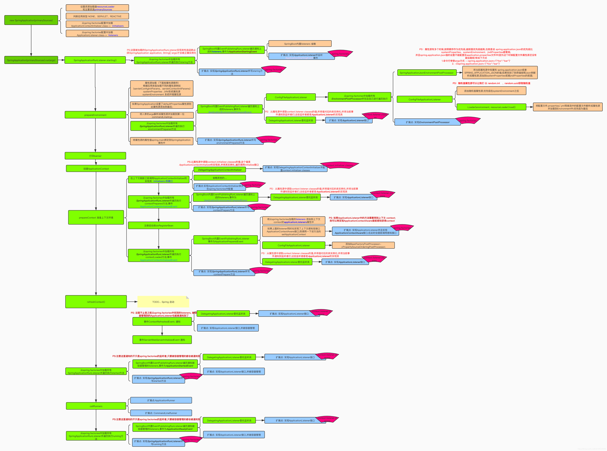

## spring.factories废弃

老版本配置方式

- META-INF/spring.factories
- @Configuration

新版本配置方式

- META-INF/spring/org.springframework.boot.autoconfigure.AutoConfiguration.imports
- @AutoConfiguration

兼容代码

```java
# AutoConfigurationExcludeFilter
protected List<String> getAutoConfigurations() {
 if (this.autoConfigurations == null) {
  this.autoConfigurations = ImportCandidates.load(AutoConfiguration.class, this.beanClassLoader)
   .getCandidates();
 }
 return this.autoConfigurations;
}
```

## @Conditional过滤

在 Spring Boot 中，@Conditional 注解的判断是在 Bean 的注册阶段进行的。Spring Boot 在启动时会扫描项目中的所有配置类，并解析其中的 @Conditional 注解，然后根据条件判断是否应该注册对应的 Bean。

具体的判断逻辑在 org.springframework.context.annotation.ConditionEvaluator 类中实现。
```java
public class ConditionEvaluator {

    // ...

    public boolean shouldSkip(ConfigurationConditionContext context, AnnotatedTypeMetadata metadata) {
        // 解析 @Conditional 注解
        ConditionOutcome outcome = getConditionOutcome(context, metadata);
        if (outcome == null) {
            return false;
        }
        if (!outcome.isMatch()) {
            if (logger.isTraceEnabled()) {
                logger.trace("Condition did not match");
            }
            return true;
        }
        if (logger.isTraceEnabled()) {
            logger.trace("Condition matched");
        }
        return false;
    }

    private ConditionOutcome getConditionOutcome(ConfigurationConditionContext context, AnnotatedTypeMetadata metadata) {
        // 获取所有的 @Conditional 注解
        List<Condition> conditions = new ArrayList<>();
        for (String[] conditionClasses : getConditionClasses(metadata)) {
            for (String conditionClass : conditionClasses) {
                Condition condition = getCondition(conditionClass, context.getClassLoader());
                conditions.add(condition);
            }
        }
        // 判断条件是否匹配
        return getConditionOutcome(context, metadata, conditions);
    }

    private ConditionOutcome getConditionOutcome(ConfigurationConditionContext context, AnnotatedTypeMetadata metadata, List<Condition> conditions) {
        // 判断条件是否匹配
        for (Condition condition : conditions) {
            ConditionOutcome outcome = condition.getMatchOutcome(context, metadata);
            if (logger.isTraceEnabled()) {
                logger.trace("Condition " + condition + " resulted in " + outcome);
            }
            if (!outcome.isMatch()) {
                return outcome;
            }
        }
        return ConditionOutcome.match();
    }

    // ...
}
```

在 shouldSkip 方法中，首先调用 getConditionOutcome 方法解析 @Conditional 注解，并判断条件是否匹配。如果条件匹配，则返回 false，表示不应该跳过该 Bean 的注册；如果条件不匹配，则返回 true，表示应该跳过该 Bean 的注册。

总的来说，Spring Boot 在 Bean 的注册阶段会解析 @Conditional 注解，并根据条件判断是否应该注册对应的 Bean。

## 常用@Condition条件注解

1. @ConditionalOnClass：当类路径中存在指定的类时，才会生效。通常于控制 bean 的创建或配置类的加载，以便在特定的类存在时才进行相应配置或初始化操作。
2. @ConditionalOnMissingClass：当类路径中不存在指定的类时，才会效。通常用于控制 bean 的创建或配置类的加载，以便在特定的类不存在才进行相应的配置或初始化操作。
3. @ConditionalOnBean：当容器中存在指定的 bean 时，才会生效。通用于控制 bean 的创建或配置类的加载，以便在容器中已经存在某个bean 时才进行相应的配置或初始化操作。
4. @ConditionalOnMissingBean：当容器中不存在指定的 bean 时，才生效。通常用于控制 bean 的创建或配置类的加载，以便在容器中不存在个 bean 时才进行相应的配置或初始化操作。
5. @ConditionalOnProperty：当指定的配置属性存在且值符合预期时，会生效。通常用于控制 bean 的创建或配置类的加载，以便在指定的配置性满足条件时才进行相应的配置或初始化操作。
6. @ConditionalOnResource：当类路径中存在指定的资源文件时，才会效。通常用于控制 bean 的创建或配置类的加载，以便在特定的资源文件在时才进行相应的配置或初始化操作。
7. @ConditionalOnWebApplication：当应用程序是一个 Web 应用程时，才会生效。通常用于控制 bean 的创建或配置类的加载，以便在应用序是 Web 应用程序时才进行相应的配置或初始化操作。
8. @ConditionalOnNotWebApplication：当应用程序不是一个 Web 应程序时，才会生效。通常用于控制 bean 的创建或配置类的加载，以便在用程序不是 Web 应用程序时才进行相应的配置或初始化操作。

## Spring Boot流程图

