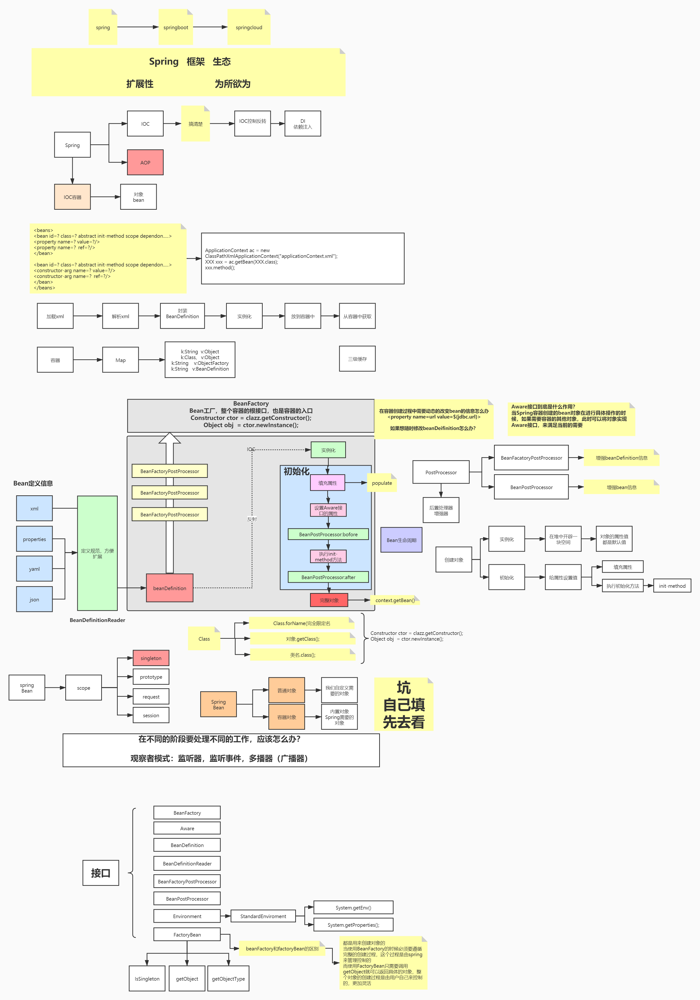
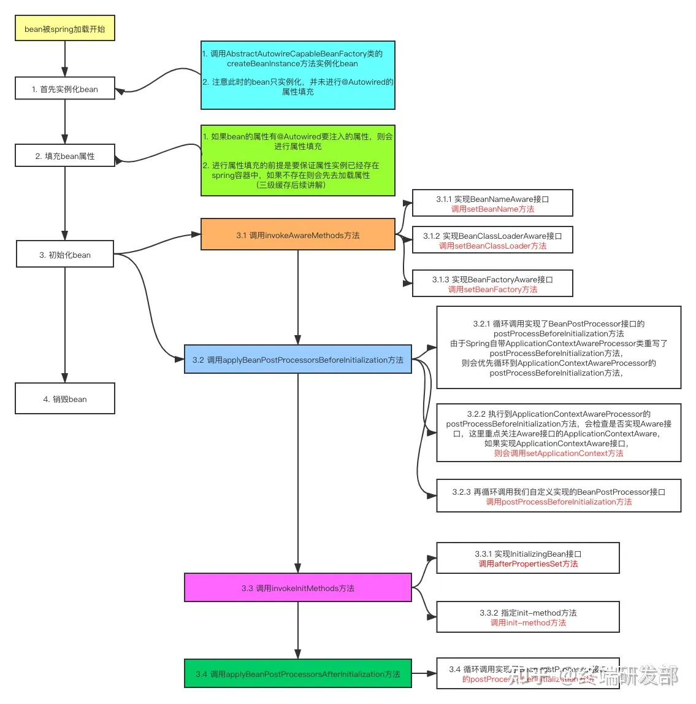

# IOC容器源码

IOC(Inversion of Control:控制反转) 总体来说有两处地方最重要，一个是创建 Bean 容器，一个是初始化 Bean

## 为什么叫控制反转？

- 控制：指的是对象创建（实例化、管理）的权力
- 反转：控制权交给外部环境（Spring 框架、IoC 容器）

## Spring源码关键类

DefaultListableBeanFactory:默认Bean工厂
AbstractApplicationContext
AbstractBeanFactory
BeanFactory
BeanDefinition
BeanDefinitionRegistry
BeanPostProcessor

## 关键接口

BeanFactory:创建Bean,需要遵循严格的Bean生命周期

Aware:获取容器内组件类，如ApplicationContext,BeanDefination信息

BeanDefination:Bean定义信息

BeanFactoryPostProcessor:增强BeanDefination信息

BeanPostProcessor:增强Bean信息

Environment:环境变量

FactoryBean:创建Bean,由用户自己管理，通过getObject()返回具体对象，创建过程由用户实现，更加灵活

- isSingleton
- getObject
- getObjectType

初始化流程图

## Spring模块依赖关系图

## 自定义扩展

1. 属性编辑器
   - 自定义实现继承PropertyEditorSupport-->setAsText
   - 自定义注册器，实现PropertyEditorRegistrar接口
   - 让spring识别到对应的注册器

[参考链接](https://javadoop.com/post/spring-ioc)
