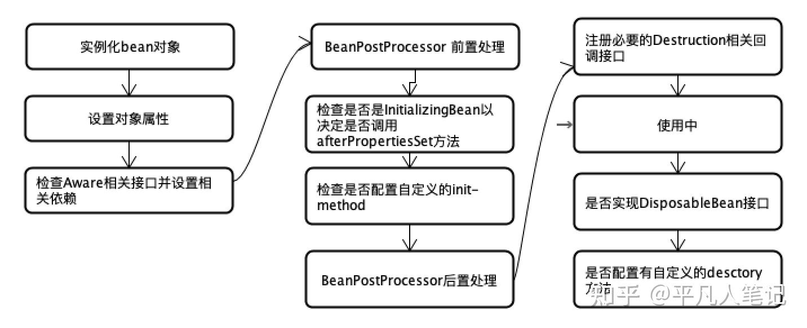

## 1. 谈谈对Spring IOC的理解

### 总

控制反转：理论思想，原来的对象是由使用者来进行控制，有了spring之后，可以把整个对象交给Spring来帮我门进行管理
DI:依赖注入，把对应的属性的值注入到具体的对象中，@Autowired,populateBean完成属性值的注入
容器：存储对象，使用map结构来存储，在Spring中一般存在三级缓存，singletonObject存放完成的bean对象，整个bean的生命周期，从创建到使用到销毁的过程全部都是由容器来管理（bean的生命周期）

### 分

1. 一般聊IOC容器的时候要涉及容器的创建过程（BeanFactory,DefaultListableBeanFactory）,向bean工厂中设置一些参数（BeanPostProcessor,Aware接口的子类）等等属性
2. 加载解析bean对象，准备要创建的bean对象的定义对象beanDefinition(xml,或者注解的解析过程)
3. beanFactoryPostProcesssor的处理，此处是扩展点，PlaceHolderConfigueSupport,ConfigurationClassPostProcessor
4. BeanPostProcessor的注册功能，方便后续对bean对象完成具体的扩展功能
5. 通过反射的方式将beanDefinition对象实例化成具体的bean对象
6. bean对象的初始化过程（populateBean填充属性，调用aware子类的方法，调用BeanPostProcessor前置处理方法，调用init-method方法，BeanPostProcessor的后置处理方法）
7. 生成完成的bean对象，通过getBean方法可以直接获取
8. 销毁过程
这是我对ioc的整体理解，包含了一些详细的梳理过程，您看一下有什么问题，可以指点一下

## 2. 谈一下Spring IOC的底层实现

底层实现：反射，工厂，设计模式，关键的几个方法

createBeanFactory,getBean, doGetBean, createBean,doCreateBean,createBeanInstance, populateBean

    1.先通过createBeanFactory创建出一个Bean工厂（DefaultListableBeanFactory）
    2.开始循环创建对象，因为容器中的bean默认都是单例的，优先通过getBean,doGetBean从容器 中查找，
    3， 通过createBean,doCreateBean创建对象 
    4.进行对象属性填充populateBean
    5.进行其他的初始化操作（initializingBean） 

## 3. 描述一下bean的生命周期



1. 实例化bean对象(反射的方式生成对象)
2. 设置对象属性（populateBean,循环依赖）
3. 检查Aware相关接口并设置相关依赖 (invokeAwareMethod(完成BeanName,BeanFactory,BeanClassLoader对象的属性设置))
4. BeanPostProcessor前置处理，使用比较多的有ApplicationContextPostProcessor,
5. 调用自定义的init-method invokeInitMethod()检查是否是InitializingBean以决定是否调用afterPropertiesSet方法
6. BeanPostProcessor后置处理，使用比较多的是Spring AOP在此处实现，AbstractAutoProxyCreator
7. 获取到完整的对象，通过getBean的方法来进行对象获取
8. 销毁流程：1判断是否实现了DisposableBean 2调用destroyMethod方法

## 4. Spring是如何解决循环依赖的问题

三级缓存，提前暴露对象，aop
总：
解释循环依赖问题，A依赖B,B依赖A
分：
先说bean的创建过程，实例化，初始化（填充属性）

    Spring使用三级缓存来解决循环依赖问题。当创建一个Bean时，Spring会将其加入到三级缓存中，分别为singletonObjects、earlySingletonObjects和singletonFactories。
    在处理循环依赖时，Spring会先尝试从singletonObjects缓存中获取Bean的实例，如果无法获取到，则会检查earlySingletonObjects缓存。如果仍然无法获取到，则会调用singletonFactories中的FactoryBean来创建Bean的实例。

- 一级缓存：singletonObjects (存放实例化并已初始化的完整对象)
- 二级缓存：earlySingletonObjects（实例化但未完成初始化的对象，由三级缓存放进来）
- 三级缓存：singletonFactories （创建单例 Bean 实例的 ObjectFactory 对象）
  **每次getObject方法返回的实例不是同一个对象**，需要二级缓存来缓存一下三级缓存生成的bean

  不用三级缓存也可以解决循环依赖，但是如果有需要aop增强的bean时，就要在初始化bean的时候对bean做增强了，这违背了Spring在结合AOP跟Bean的生命周期的设计！Spring结合AOP跟Bean的生命周期本身就是通过AnnotationAwareAspectJAutoProxyCreator这个后置处理器来完成的，在这个后置处理的postProcessAfterInitialization方法中对初始化后的Bean完成AOP代理。如果出现了循环依赖，那没有办法，只有给Bean先创建代理，但是没有出现循环依赖的情况下，设计之初就是让Bean在生命周期的最后一步完成代理而不是在实例化后就立马完成代理。

如果 Spring 选择二级缓存来解决循环依赖的话，那么就意味着所有 Bean 都需要在实例化完成之后就立马为其创建代理，而 Spring 的设计原则是在 Bean 初始化完成之后才为其创建代理。

## 5. BeanFactory和FactoryBean有什么区别

- 相同点：都是用来创建bean对象
- 不同点：使用BeanFactory创建对象时，必须要遵循严格的生命周期流程，如果想象简单的自定义某个对象的创建，同时创建完成的对象想交给spring来管理，那就需要实现FactoryBean接口

## 6. Spring中用到什么设计模式

- 单例模式：bean默认都是单例的
- 原型模式：指定作用域为procotype
- 工厂模式：BeanFactory
- 模版方法：jdbcTemplate
- 策略模式：XmlBeanDefinitionReader,PropertiesBeanDefinitonReader
- 观察者模式：listener,event,multicast
- 适配器模式：AOP中使用AdvisorAdapter
- 装饰者模式：BeanWrapper
- 责任链模式：使用aop的时候会先生成一个拦截器链
- 代理模式：动态代理 AOP实现
- 委托者模式：delegate
- 钩子设计模式：BeanPostProcessor提供两个钩子方法

## 7. Spring AOP底层实现原理

aop是ioc的一个扩展功能，先有ioc再有aop,只是在ioc的整个流程中新增的一个扩展点：BeanPostProcessor

总：aop概念，应用场景，动态代理

分：bean的创建过程中有一个步骤可以对bean进行扩展实现，aop本身就是一个扩展功能在BeanPostProcessor的后置处理中进行实现

1. 代理对象的创建过程（advice,切面，切点）
2. 通过jdk或者cglib的方式生成代理对象
3. 在执行方法调用的时候，会调用到生成的字节码文件中，直接会找DynamicAdvisorInterceptor类中的intercept方法开始执行
4. 根据之前定义好的通知来生成拦截器链
5. 从连接器链中一次获取每一个通知开始进行执行，在执行过程中为了方便找到下一个通知是哪个，会有一个CglibMethodInvocation的对象，找的时候是从-1的位置依次开始查找并且执行的

## 8. Spring事务是如何回滚的

总：spring的事务是由aop来实现，首先生成具体的代理对象，然后按照aop的整套流程来执行具体的操作逻辑，正常情况通过通知来完成核心功能，但是事务不是通过通知来实现，而是通过TransactionInterceptor来实现,然后调用invoke来实现具体逻辑

分：

1. 先做准备工作，解析各个方法上事务相关的属性，根据具体的属性来判断是否开启新事务
2. 当需要开启的时候，获取数据库链接，关闭自动提交功能，开启事务
3. 执行具体的sql逻辑
4. 在操作过程中，如果执行失败了，会通completeTransactionAfterThrowing来完成事务的回滚操作，回滚的逻辑是通过doRollBack方法来实现的，实现的时候也是先获取连接对象，通过连接对象来回滚
5. 如果执行过程中，没有任何意外发生，通过commitTransactionAfterReturning来完成事务的提交操作，提交的逻辑是通过doCommit方法来实现的，实现的时候也是先获取连接对象，通过连接对象来提交
6. 当事务执行完毕之后需要清楚相关的事务信息cleanupTransactionInfo

## 9. 谈一下Spring事务

传播特性7种：Propagation.REQUIRED,Propagation.REQUIRES_NEW,Propagation.MANDATORY,Propagation.NESTED,Propagation.NEVER,Propagation.NOT_SUPPORTED,Propagation.SUPPORTS

1. **REQUIRED**：默认的传播行为。如果当前存在事务，则加入该事务；如果当前没有事务，则新建一个事务。

2. **REQUIRES_NEW**：始终开启一个新的事务，如果当前存在事务，则将当前事务挂起。

3. **SUPPORTS**：如果当前存在事务，则加入该事务；如果当前没有事务，则以非事务方式执行。

4. **MANDATORY**：要求当前存在事务，如果不存在事务，则抛出异常。

5. **NOT_SUPPORTED**：以非事务方式执行，如果当前存在事务，则将当前事务挂起。

6. **NEVER**：以非事务方式执行，如果当前存在事务，则抛出异常。

7. **NESTED**：如果当前存在事务，则在嵌套事务中执行；如果当前没有事务，则开启一个新的事务。

事务隔离级别：Isolation.REPEATABLE_READ,Isolation.READ_COMMITTED,Isolation.READ_UNCOMMITTED,Isolation.SERIALIZABLE

A方法调用B方法，AB都有事务，并且传播特性不同，A异常B怎么办，B异常A怎么办

事务分类 支持当前事务，不支持当前事务，嵌套事务

融入(一个事务)

```sql
start transaction;
    
commit;

```

挂起(挂起外层事务)

嵌套（通过保存点savepoint实现）

## 10.JDK动态代理和CGLIB动态代理的区别？

Spring AOP中的动态代理主要有两种方式：JDK动态代理和CGLIB动态代理。

JDK动态代理

如果目标类实现了接口，Spring AOP会选择使用JDK动态代理目标类。代理类根据目标类实现的接口动态生成，不需要自己编写，生成的动态代理类和目标类都实现相同的接口。JDK动态代理的核心是InvocationHandler接口和Proxy类。

缺点：目标类必须有实现的接口。如果某个类没有实现接口，那么这个类就不能用JDK动态代理。

CGLIB动态代理通过继承实现。

如果目标类没有实现接口，那么Spring AOP会选择使用CGLIB来动态代理目标类。CGLIB（Code Generation Library）可以在运行时动态生成类的字节码，动态创建目标类的子类对象，在子类对象中增强目标类。

CGLIB是通过继承的方式做的动态代理，因此如果某个类被标记为final，那么它是无法使用CGLIB做动态代理的。

优点：目标类不需要实现特定的接口，更加灵活。

什么时候采用哪种动态代理？

1. 如果目标对象实现了接口，默认情况下会采用JDK的动态代理实现AOP
2. 如果目标对象实现了接口，可以强制使用CGLIB实现AOP
3. 如果目标对象没有实现了接口，必须采用CGLIB库

两者的区别：

1. jdk动态代理使用jdk中的类Proxy来创建代理对象，它使用反射技术来实现，不需要导入其他依赖。cglib需要引入相关依赖：asm.jar，它使用字节码增强技术来实现。
2. 当目标类实现了接口的时候Spring Aop默认使用jdk动态代理方式来增强方法，没有实现接口的时候使用cglib动态代理方式增强方法。
