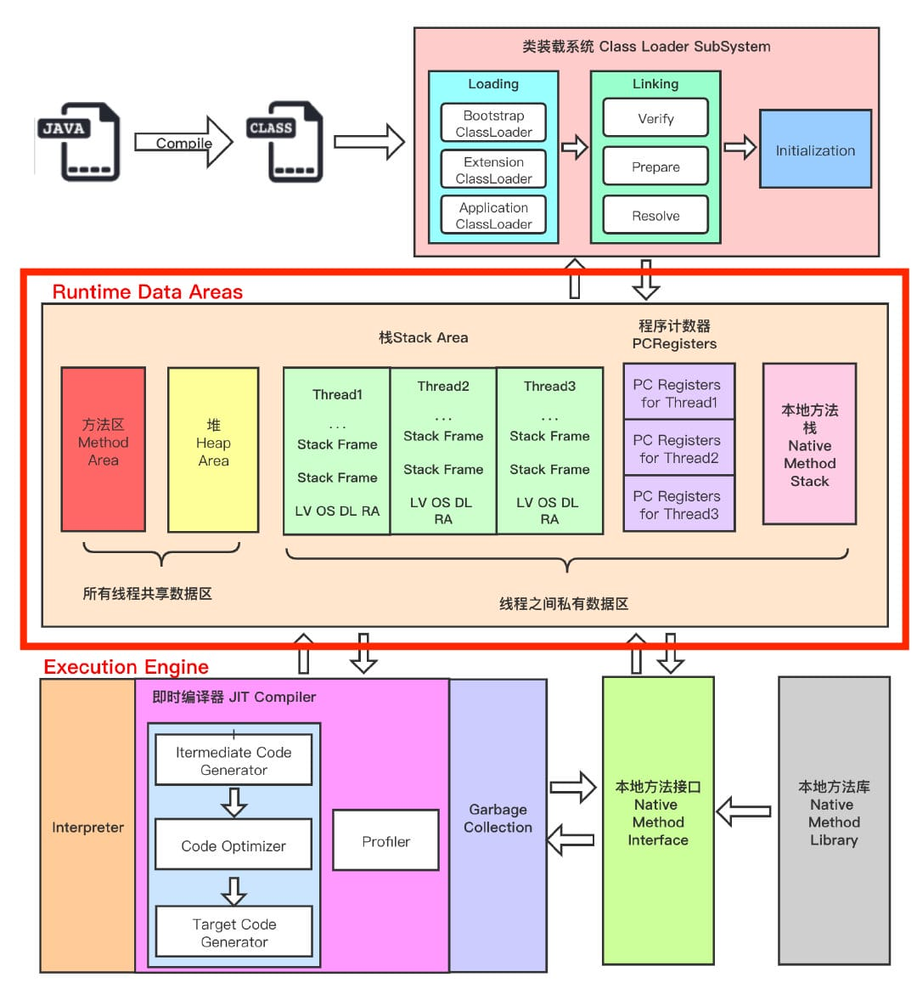
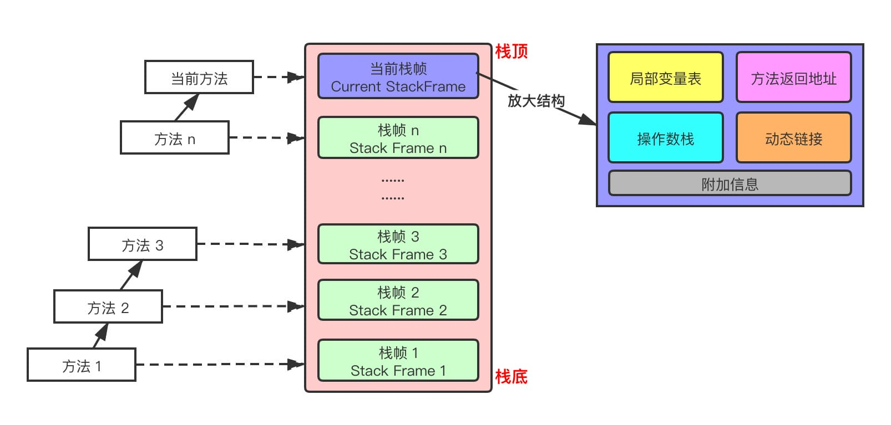

# Java编译到执行过程

1. 编译（将java源文件编译成class文件）
    语法分析、语义分析、注解处理等，最终生成class文件
2. 加载（将class文件加载到JVM中）
   - 加载：通过类加载器将class文件加载到JVM中，使用双亲委派机制，生成对应的Class对象，将类信息存储至方法区
   - 连接：class信息验证、分配内存空间、赋默认值
      - 验证：验证类信息是否符合JVM规范
      - 准备：类静态变量分配内存，初始化为默认值
      - 解析：将符号引用转换为直接引用
   - 初始化：类变量分配内存，初始化为默认值，将类静态变量赋值为正确值
3. 解释（把字节码转换成操作系统识别的指令）
   - 字节码解释器
   - 即时编译器（JIT）:热点代码触发JIT,执行时就无需重复进行解释
4. 执行


# 类加载器

- 启动类加载器（BootstrapClassloader）,加载JDK的核心类，负责加载存放在JDK\jre\lib（java.*）
- 扩展类加载器（ExtClassloader）,负责加载JDK\jre\lib\ext目录中所有的类（如javax.*开头的类）
- 应用类加载器（AppClassloader）

自定义类加载器,尽量不重写loadClass方法，会破坏双亲委派，只重写findClass

```java
package com.pdai.jvm.classloader;
import java.io.*;

public class MyClassLoader extends ClassLoader {

    private String root;

    protected Class<?> findClass(String name) throws ClassNotFoundException {
        byte[] classData = loadClassData(name);
        if (classData == null) {
            throw new ClassNotFoundException();
        } else {
            return defineClass(name, classData, 0, classData.length);
        }
    }

    private byte[] loadClassData(String className) {
        String fileName = root + File.separatorChar
                + className.replace('.', File.separatorChar) + ".class";
        try {
            InputStream ins = new FileInputStream(fileName);
            ByteArrayOutputStream baos = new ByteArrayOutputStream();
            int bufferSize = 1024;
            byte[] buffer = new byte[bufferSize];
            int length = 0;
            while ((length = ins.read(buffer)) != -1) {
                baos.write(buffer, 0, length);
            }
            return baos.toByteArray();
        } catch (IOException e) {
            e.printStackTrace();
        }
        return null;
    }

    public String getRoot() {
        return root;
    }

    public void setRoot(String root) {
        this.root = root;
    }

    public static void main(String[] args)  {

        MyClassLoader classLoader = new MyClassLoader();
        classLoader.setRoot("D:\\temp");

        Class<?> testClass = null;
        try {
            testClass = classLoader.loadClass("com.pdai.jvm.classloader.Test2");
            Object object = testClass.newInstance();
            System.out.println(object.getClass().getClassLoader());
        } catch (ClassNotFoundException e) {
            e.printStackTrace();
        } catch (InstantiationException e) {
            e.printStackTrace();
        } catch (IllegalAccessException e) {
            e.printStackTrace();
        }
    }
}
```

# JVM内存结构



- 程序计数器
- 虚拟机栈 （线程执行时创建的栈，用于存储局部变量，方法调用）
- 本地方法栈（存储本地方法调用的栈）
- 堆
- 方法区（已加载的类信息）

> 线程私有：程序计数器、虚拟机栈、本地方法栈
>
>线程共享：堆、方法区, 堆外内存（Java7的永久代或JDK8的元空间、代码缓存）

### 程序计数器

jvm通过修改程序计数器来获取下一条需要执行的数据

### 虚拟机栈

JVM对虚拟机栈操作，方法运行时入栈，方法调用结束时出栈，栈空间大小可以通过-Xss来指定，栈中的数据都是以栈帧（Stack Frame）的格式存在

**局部变量表中的变量也是重要的垃圾回收根节点，只要被局部变量表中直接或间接引用的对象都不会被回收**

**操作数栈，主要用于保存计算过程的中间结果，同时作为计算过程中变量临时的存储空间**


### 本地方法栈

与外部方法调用交互，用于管理本地方法的调用，**在 Hotspot JVM 中，直接将本地方法栈和虚拟机栈合二为一**

### 堆
新生代：Eden区，两个survivor区，Eden区满触发Minor GC
老年代：大对象和经过多次Minor GC(年龄阈值`-XX:MaxTenuringThreshold`默认15)还存活的对象，老年代内存不足时触发Major GC
-Xms:初始堆内存和-Xmx：堆内存最大值，设置为同一个值，能够在垃圾回收机制清理完堆区后不再需要重新分隔计算堆的大小，从而提高性能

TLAB （Thread Local Allocation Buffer）:从内存模型而不是垃圾回收的角度，对 Eden 区域继续进行划分，JVM 为每个线程分配了一个私有缓存区域，它包含在 Eden 空间内多线程同时分配内存时，使用 TLAB 可以避免一系列的非线程安全问题，同时还能提升内存分配的吞吐量，因此我们可以将这种内存分配方式称为快速分配策略

进一步优化堆内存采用了逃逸分析，将原本需要在堆中分配内存的对象，放到虚拟机栈中进行分配，随着弹出栈，对应的对象会自动销毁，不会产生垃圾对象。
逃逸分析：栈上分配，同步消除（synchronized锁消除）,分离对象或标量替换（将对象拆成Java 中的原始数据类型）

### 方法区
JVM 规范中定义的一个概念，用于存储类信息、常量池、静态变量、JIT编译后的代码等数据，永久代（java7）和元空间(java8)是对应的落地实现

元空间使用本地内存，存储类的元信息。常量池、静态变量存储在堆中

`-XX:MetaspaceSize` 和 `-XX:MaxMetaspaceSize` 用来设置元空间参数

### Full GC 的触发条件

对于 Minor GC，其触发条件非常简单，当 Eden 空间满时，就将触发一次 Minor GC。而 Full GC 则相对复杂，有以下条件:
1. 调用 System.gc()

只是建议虚拟机执行 Full GC，但是虚拟机不一定真正去执行。不建议使用这种方式，而是让虚拟机管理内存。
2. 老年代空间不足

老年代空间不足的常见场景为前文所讲的大对象直接进入老年代、长期存活的对象进入老年代等。

为了避免以上原因引起的 Full GC，应当尽量不要创建过大的对象以及数组。除此之外，可以通过 -Xmn 虚拟机参数调大新生代的大小，让对象尽量在新生代被回收掉，不进入老年代。还可以通过 -XX:MaxTenuringThreshold 调大对象进入老年代的年龄，让对象在新生代多存活一段时间。
3. 空间分配担保失败

使用复制算法的 Minor GC 需要老年代的内存空间作担保，如果担保失败会执行一次 Full GC。
1. JDK 1.7 及以前的永久代空间不足

在 JDK 1.7 及以前，HotSpot 虚拟机中的方法区是用永久代实现的，永久代中存放的为一些 Class 的信息、常量、静态变量等数据。

当系统中要加载的类、反射的类和调用的方法较多时，永久代可能会被占满，在未配置为采用 CMS GC 的情况下也会执行 Full GC。如果经过 Full GC 仍然回收不了，那么虚拟机会抛出 java.lang.OutOfMemoryError。

为避免以上原因引起的 Full GC，可采用的方法为增大永久代空间或转为使用 CMS GC。
5. Concurrent Mode Failure

执行 CMS GC 的过程中同时有对象要放入老年代，而此时老年代空间不足(可能是 GC 过程中浮动垃圾过多导致暂时性的空间不足)，便会报 Concurrent Mode Failure 错误，并触发 Full GC。


垃圾清除算法：标记清除算法、复制算法、标记整理算法

卡表：能够避免扫描老年代的所有对应进而顺利进行Minor GC（老年代对象持有年轻代对象引用）

如何判断为垃圾：可达性分析算法和引用计算算法，JVM使用的是可达性分析算法

什么是GC Roots：GC Roots是一组必须活跃的引用，跟GC Roots无关联的引用即是垃圾，可被回收

# CMS垃圾收集器

CMS垃圾回收器设计目的：为了避免「老年代 GC」出现「长时间」的卡顿（Stop The World）

CMS垃圾回收器回收过程：初始标记、并发标记、并发预处理、重新标记和并发清除。初始标记以及重新标记这两个阶段会Stop The World

CMS垃圾回收器的弊端：会产生内存碎片&&需要空间预留：停顿时间是不可预知的
