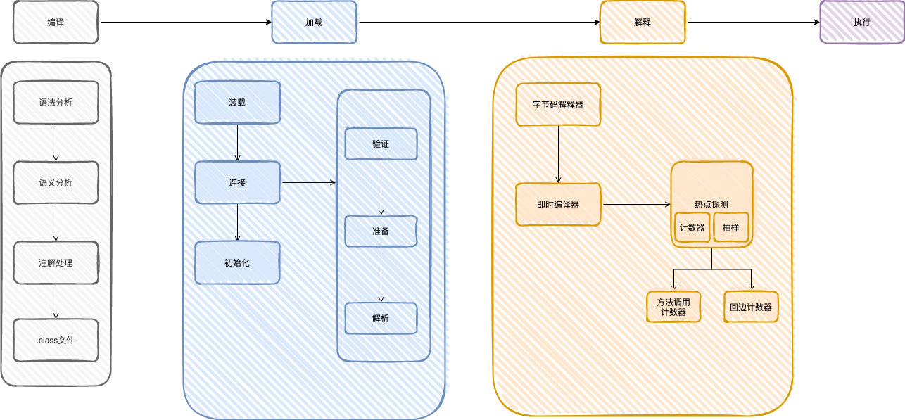

# Java编译到执行过程

1. 编译（将java源文件编译成class文件）
    语法分析、语义分析、注解处理等，最终生成class文件
2. 加载（将class文件加载到JVM中）
   - 装载：通过类加载器将class文件加载到JVM中，使用双亲委派机制，生成对应的Class对象，将类信息存储至方法区
   - 连接：class信息验证、分配内存空间、赋默认值
   - 初始化：为静态变量赋值
3. 解释（把字节码转换成操作系统识别的指令）
   - 字节码解释器
   - 即时编译器（JIT）:热点代码触发JIT,执行时就无需重复进行解释
4. 执行

